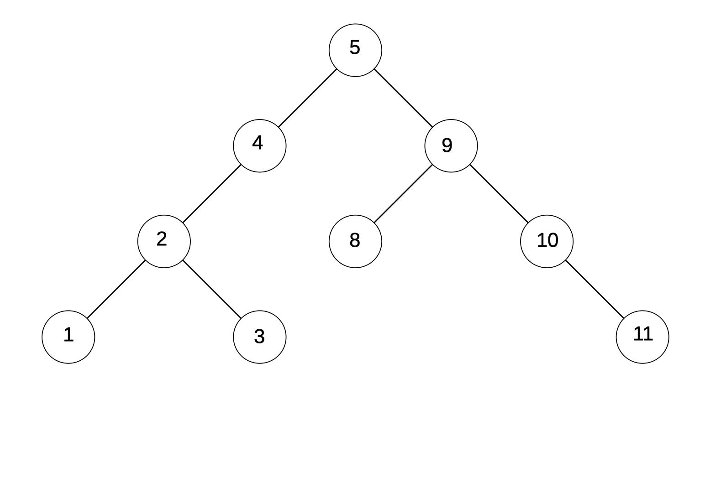

# Binary Search

## Introduction

"Binary Search" est un algorithme de recherche de valeur dans un tableau en informatique.

Par exemple dans un arbre binaire comme ci-dessous.


Propriété d'un arbre binaire :
- contient 1, 2, ou 0 noeud.
- Depuis chaque noeud, les noeuds se trouvont à gauche ont une valeur plus petite
que le noeud en question et à droite des valeurs grand.
- Le temps de recherche dépend de la hauteur de l'arbre, autrement dit : `O(h)` 
si celle-ci est bien organiser. Voir [Time complexity](https://en.wikipedia.org/wiki/Time_complexity) pour plus d'informations.

## But

Le but est donc de sur la base des infomations ci-dessus et de l'arbre binaire 
ci-dessous d'écrire une function en **typescript** qui fait un "Binary Search" et
qui prend comme paramètres l'arbre binaire et la valeur rechechée.
Puis comme exemples rechercher les valeurs **13**, **11** et **8**.

```javascript
const head: BNode = {
    value: 10,
    left: {
        value: 8,
        left: {
            value: 3,
            right: null,
            left: {
                value: 1,
                right: null,
                left: null
            }
        },
        right: {
            value: 9,
            right: null,
            left: null,
        }
    },
    right: {
        value: 12,
        left: {
            value: 11,
            left: null,
            right: null,
        },
        right: {
            value: 15,
            left: {
                value: 14,
                left: {
                    value: 13,
                    left: null,
                    right: null,
                },
                right: null
            },
            right: null,
        }
    }
};

```

## Crédits

- Toutes ces informations viennent principalement de la [vidéo](https://www.youtube.com/watch?v=1CRkRdDT4cA) de [ThePrimagen](https://github.com/ThePrimeagen)
- Puis aussi de [Wikipédia](https://en.wikipedia.org/wiki/Binary_search_algorithm)


